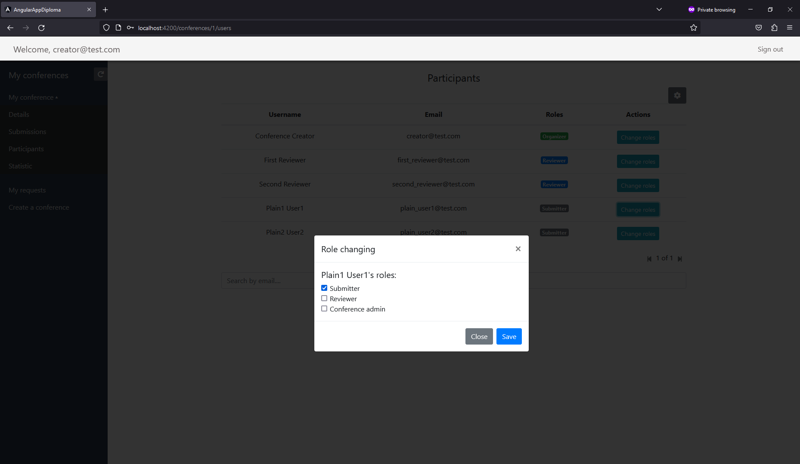

# Conference Management System

My bachelor's graduate work.

## About
I was trying to create a system similar to EasyChair.\
The application has a role system.\
The basic flow:
1) You apply with your conference, and then application admin validates your request and creates the conference.\
2) You acquire the organizer role and can invite users into conference.
3) Assign conference roles on a participant's page. There are several roles within a conference: 
   * submitter - submits a thesis
   * conference admin - can manage roles and send submissions on review
   * reviewer - reviews user's submissions
4) After thesis was submitted, conference admin has to assign reviewers, and send it on review
5) Reviewers can download it and write a review in the system
6) If thesis is not acceptable, then Submitter has to edit and reupload it
7) Conference admin sends it on review one more time
8) The process continues until thesis will be accepted

## Environment
* Windows 10
* Java 20
* Gradle 7.5
* Node 18.17.1
* NPM 10.1.0

## Architecture

## Start
All commands should be executed from the root project folder

### Frontend
```console
cd frontend

npm install

npm start
```
### Backend
```console
cd backend

gradlew.bat clean build bootRun
```

## Usage
Application will be displayed at http://localhost:4200

There is stub data for conferences. Home page will display several conferences, but only first one has predefined participants:
* organizer
  * login: creator@test.com
  * password: test
* 1 reviewer
  * login: first_reviewer@test.com
  * password: test
* 2 reviewer
  * login: second_reviewer@test.com
  * password: test
* 1st plain user
  * login: plain_user1@test.com
  * password: test
* 2nd plain user
  * login: plain_user2@test.com
  * password: test

## TODO
- [ ] Introduce object storage for documents (MinIo - open source solution)
- [ ] Switch from h2 to postgresql
- [ ] Introduce database change library: Liquibase/Flyway
- [ ] Move from custom security to OpenID Connect (Keycloak)
- [ ] Code refactoring & Tests
- [ ] Rewrite reviewing system: Move from 'reviewers per submissions' to 'reviewers per conference'

## Screenshots





